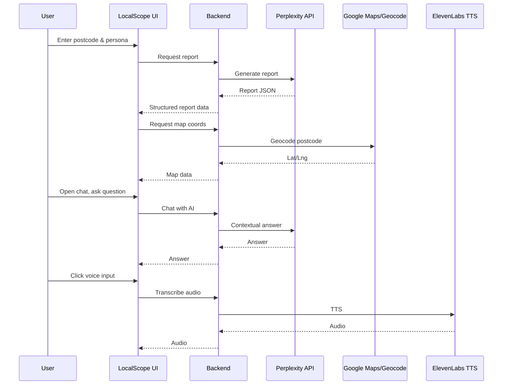
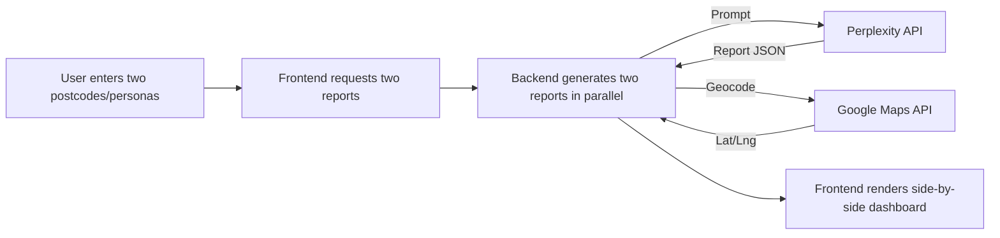

# LocalScope AI — Architecture & Flow Diagrams

## 1. High-Level Architecture

```mermaid
flowchart TD
  subgraph Frontend [Next.js Frontend]
    A1[Landing Page / Compare Page]
    A2[Report Dashboard]
    A3[Chat Panel]
    A4[Interactive Map & Charts]
  end

  subgraph Backend [Server Actions & Genkit Flows]
    B1[generateReportFromPostcode]
    B2[chatWithAiAboutLocation]
    B3[generateSuggestedQuestions]
    B4[geocodePostcode]
    B5[textToSpeech / transcribeAudio]
    B6[Live Data Fetcher]
  end

  subgraph ExternalAPIs [External APIs & Data]
    C1[Perplexity LLM API]
    C2[Google Maps API]
    C3[ElevenLabs TTS]
    C4[Open Data (Ofsted, Crime, News)]
  end

  A1 -->|User input| A2
  A2 -->|Request| B1
  A3 -->|User question| B2
  A2 -->|Suggested Qs| B3
  A2 -->|Map/Coords| B4
  A3 -->|Voice| B5
  A2 -->|Live Data| B6

  B1 -->|AI prompt| C1
  B2 -->|AI prompt| C1
  B3 -->|AI prompt| C1
  B4 -->|Geocode| C2
  B5 -->|TTS| C3
  B6 -->|Fetch| C4

  B1 -->|Report Data| A2
  B2 -->|Chat Answer| A3
  B3 -->|Suggested Qs| A3
  B4 -->|Lat/Lng| A4
  B5 -->|Audio| A3
  B6 -->|News/Events| A2
```

---

## 2. User Flow



---

## 3. Data Flow for Compare Mode



---

## 4. (Optional) Live Data Integration

```mermaid
flowchart TD
  E1[User views report]
  E2[Backend fetches live data (news, property, crime, transport)]
  E3[Open Data APIs / News APIs]
  E2 --> E3
  E3 -- Data --> E2
  E2 -- Data --> E1
```

---

**These diagrams can be included in your documentation or README for clear technical communication.**
